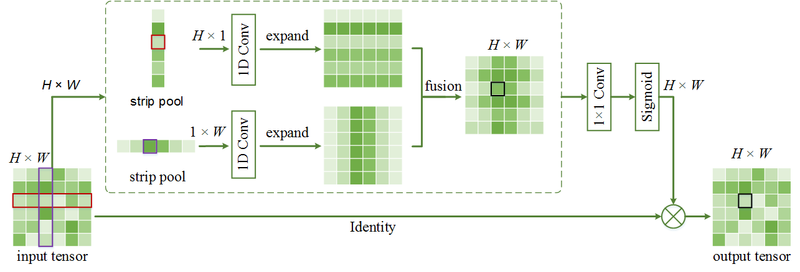

# Strip Pooling: Rethinking Spatial Pooling for Scene Parsing (Coming soon!!!)

### Introduction

This repository is a PyTorch implementation for our [CVPR2020 paper](https://arxiv.org/pdf/2003.13328.pdf).

### Strip Pooling



### Citation

You may want to cite:

```
@inproceedings{hou2020strip,
  title={{Strip Pooling}: Rethinking Spatial Pooling for Scene Parsing},
  author={Hou, Qibin and Zhang, Li and Cheng, Ming-Ming and Feng, Jiashi},
  booktitle={CVPR},
  year={2020}
}
```
